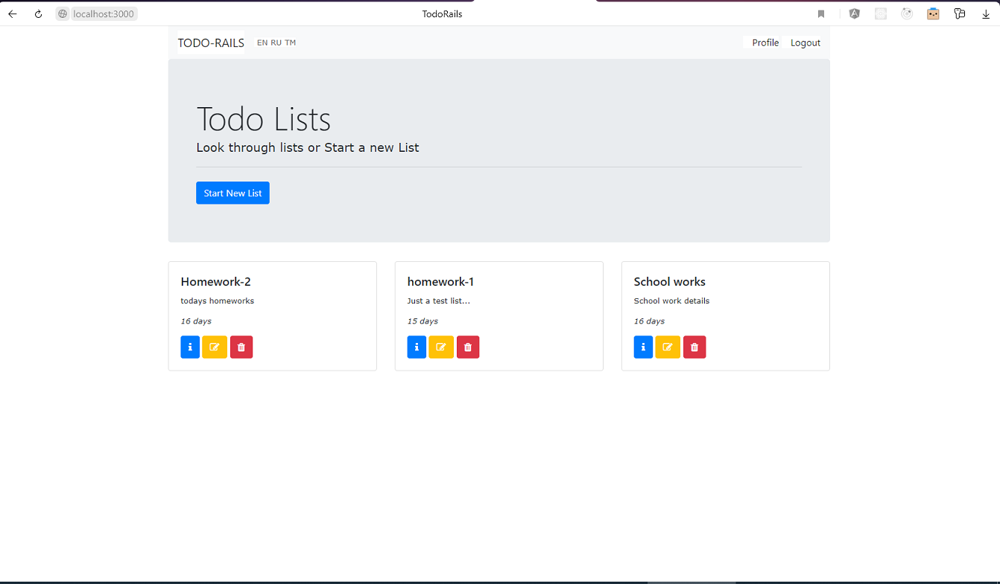
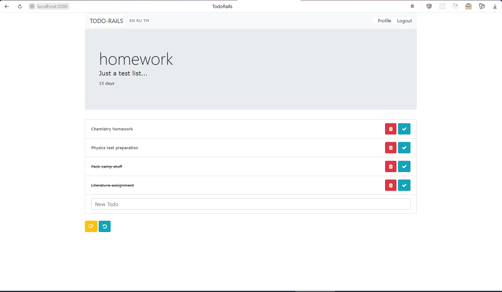

# Rails-Todo-list
To-do list, implemented in Rails only (+ Bootstrap)

Author : Merdan Durdyýew  
Github : https://github.com/eminarium  
Medium (Personal blog) : https://merdan-durdiyev.medium.com/  
Medium (Publication / Turkmen content) : https://medium.com/kodeser  
Medium (Publication / English content) : https://medium.com/kode-art  
Dev.to : https://dev.to/eminarium  
Date : 05.12.2020  
  
Beýany: "Todo list" - Adaty Rails esbaplary bilen ýazylan, Bootstrap    
elementleri bilen bezelen, ýumuşlar sanawy priloženiýasy.    
Ulanylan esbaplar aşakda görkezilen.  
  
Description : "Todo list" - a program developed with bare Rails tools and  
Bootstrap for decoration.  
List of extra tools used are shown below.  
  
    
Database: Postgres  

Gems used:  
- Devise (for authentication)  
- friendly_id (for slug)  
- rails-i18n (for translation/ :en, :ru, :tm locales used)  
  
  
Screenshot:

All Todo Lists  
  
  
  
Todos in a List  
  
  
  
  

Instructions:
- Install Rails (You can install Bitnami Rubystack)
https://bitnami.com/stack/ruby/installer  
- Run "bundle install" command in the project folder.  
- Run rails server => "rails s"  
- Open link "http://localhost:3000" on you computer.  

# Good Luck!
